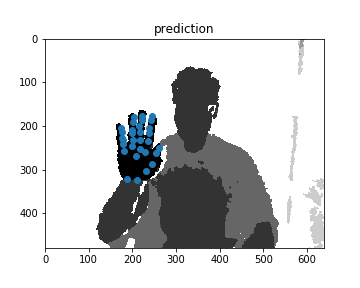
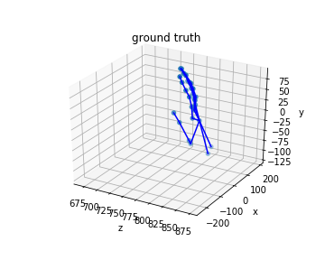
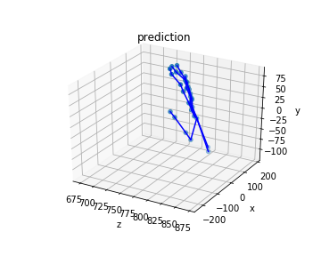
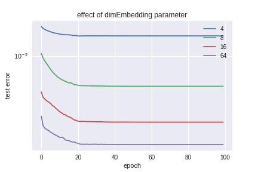

# Pytorch implementation of hand pose estimation

This repository aims to understand and implement hand pose estimation methods using Pytorch. Currently, we only provide the modified algorithm proposed in 

> [1] Oberweger, Markus, Paul Wohlhart, and Vincent Lepetit. “Hands Deep in Deep Learning for Hand Pose Estimation.” https://arxiv.org/abs/1502.06807 

# References

- https://github.com/moberweger/deep-prior
- https://github.com/xingyizhou/DeepModel 

# Dataset

- NYU 2014 dataset should be put in `data/nyu14/`

# Partial results

## Qualitative results

## Effect of bottleneck layer

To impose the prior of the low-dimensionalty of hand pose, the authors in [1] added a bottle neck layer before the last fully connected layer. The effect of dimension of this layer is provided. I expect that the lower dimensionality yields better results.  The result, however, shows that the higher dimensionalty yields better performance. I think it is related to model complexity and other parameters. I will check later again.

